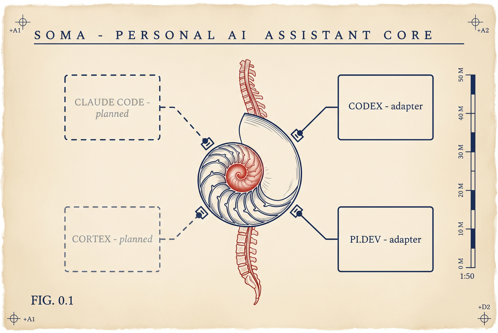

<!--
  Soma · Metafactory package landing
  Reading this raw? Visit the rendered version at meta-factory.ai or on GitHub.
-->

<p align="center">
  
</p>

<h1 align="center">Soma</h1>

<p align="center">
  <strong>Your AI assistant's identity, memory, and skills.<br />
  Kept in one place. Portable across Claude Code, OpenAI Codex, and Pi.dev.</strong>
</p>

<p align="center">
  <a href="https://meta-factory.ai/@metafactory/soma"></a>
  
  
  
  
</p>

---

## Install

```bash
arc install @metafactory/soma
```

That single command pulls a signed package from Metafactory, verifies three independent cryptographic attestations, and installs Soma into your AI assistant's home so it is available by default.

No login required. No tracking. The bytes you install are the same bytes the registry attested to.

---

## What you get in 30 seconds

- **One assistant, many coding agents.** Your principal profile, goals, memory, skills, and learning live on your machine in `~/.soma/`. Move between Claude Code, OpenAI Codex, and Pi.dev. Your assistant keeps remembering, keeps learning, and keeps you.
- **Filesystem-native by design.** Plain folders. Plain Markdown. You can read, edit, version, back up, and audit your assistant's brain with the same tools you use for everything else. No proprietary database. No vendor lock-in.
- **Cryptographically attested.** Every Soma release is signed three independent ways. Your `arc install` checks the bytes (SHA-256), the registry attestation (Ed25519), and the publisher attestation (Sigstore) before a single file lands on disk.

> [!NOTE]
> **Soma is the first package published on Metafactory.**
> We are using its release as the reference for what every Metafactory package should look like. Three-signature verification, declared capabilities, and portability across AI tools.

---

## Why Soma exists

The valuable part of a personal AI assistant is not one model and not one CLI. It is the operating system around the model. Who the assistant is, who *you* are, what you want, what good work looks like, what was learned last time, how work is verified.

Most AI tools today couple all of that to themselves. Change tools and you lose the assistant.

Soma decouples the durable parts from the tool that happens to run them. The tool becomes replaceable. The assistant keeps going.

---

## Architecture

<p align="center">
  
</p>

Soma owns the durable parts of your assistant.

| Layer | What lives there |
| --- | --- |
| **Identity** | Principal profile, assistant profile, voice and personality |
| **Telos** | Goals, principles, active commitments, desired state |
| **ISA** | Ideal-state artefacts for the projects and tasks you are running |
| **Skills** | Portable capability folders with instructions, workflows, and tools |
| **Memory** | Work, knowledge, learning, relationship, and state stores |
| **Policy** | Privacy, permission, and verification rules |
| **Adapters** | Thin bridges into the coding agents where Soma runs |

Soma deliberately does not own model selection, chat UI, tool runtimes, agent routing, or marketplace distribution. Those belong to the coding agent you happen to be using, or to other parts of the Metafactory ecosystem.

See [docs/boundaries.md](docs/boundaries.md) for the exact split.

---

## Your first session

Once installed, point Soma at the coding agent you want it to run in. Each adapter writes a small set of hooks and memory files into that agent's home so Soma activates on startup.

```bash
soma install codex --apply
soma install pi-dev --apply
```

Then start a session and watch Soma surface its context.

<!--
  Demo recording brief (replace this whole block with the rendered asset).

  Goal: a ~30-second animated demo that drops into the README as a GIF and
  shows Soma surfacing context, switching agents, and searching memory.

  Recommended tooling: charmbracelet/vhs (https://github.com/charmbracelet/vhs).
  Write the script as docs/demos/2026-05-16-soma-first-session.tape and render
  to docs/demos/2026-05-16-soma-first-session.gif. vhs is deterministic, so
  the same .tape file can be re-rendered every release for a refreshed GIF.

  Alternative: asciinema if a terminal-text recording is preferred over a GIF.
  Output to docs/demos/2026-05-16-soma-first-session.cast and embed via the
  asciinema SVG link.

  Shot list (~30 seconds, six beats):

    1. Title beat (2s)
       # Soma — same self, any coding agent.

    2. Start a session in Codex (4s)
       $ soma lifecycle session-start --substrate codex
       → startup-context block: principal, active commitments, recent learning

    3. Switch to Pi.dev — same identity, different agent (4s)
       $ soma lifecycle session-start --substrate pi-dev
       → same identity surfaces, agent-specific projection

    4. Search memory (6s)
       $ soma memory search --query "client sovereignty"
       → matches across WORK, KNOWLEDGE, LEARNING with line numbers

    5. Promote a verified run to durable learning (5s)
       $ soma memory promote --from-run <run-id> --store learning \
           --title "Client sovereignty matters"
       → promoted with source link

    6. Capture in-session feedback as a candidate event (4s)
       $ soma feedback capture --text "Forgot the arc-manifest check" \
           --substrate codex
       → classified and recorded

    Closing card (2s)
       arc install @metafactory/soma
-->

> [!NOTE]
> **Demo · first session in 30 seconds** *(animated GIF in production)*
>
> A six-beat run starting a Soma session in OpenAI Codex, switching to Pi.dev with the same identity intact, searching memory, promoting a verified run to durable learning, and capturing in-session feedback. Recorded with [`vhs`](https://github.com/charmbracelet/vhs) so it can be re-rendered every release. Full shot list in the HTML comment above this callout.

<!-- asset-slot: docs/demos/2026-05-16-soma-first-session.gif -->
<!-- replace with:  -->

> [!NOTE]
> **What you see when a session starts** *(screenshot in production)*
>
> The assistant identity card produced by `soma lifecycle session-start`. Principal, telos, active commitments, recent learning. Concrete, scannable, the same in every coding agent.

<!-- asset-slot: docs/screenshots/2026-05-16-session-start.png -->
<!-- replace with:  -->

---

## Bringing in your existing assistant

If you already run an assistant inside [Daniel Miessler's Personal AI Infrastructure (PAI)](https://github.com/danielmiessler/Personal_AI_Infrastructure), Soma can import the durable parts so you do not start from scratch.

```bash
soma import pai --dry-run
soma import pai --apply
```

This pulls your principal profile, assistant identity, and Telos summary into `~/.soma/profile/`. Source snapshots are kept under `~/.soma/profile/imports/claude/` so you can always trace what came from where.

To port over the Algorithm (a small decision and verification harness that wraps AI work in a one-way phase machine):

```bash
soma import algorithm --apply
```

And to bring across a PAI skill pack. Soma converts portable workflows and tools, marks the rest as references, and refuses to copy anything that looks like a secret.

```bash
soma import pai-pack --pai-pack-dir <path-to-pack>
soma import pai-pack --apply --pai-pack-dir <path-to-pack>
```

See [docs/pai-pack-importer.md](docs/pai-pack-importer.md) for the rules.

---

## The Algorithm in one breath

Soma ships a small deterministic harness for non-trivial work. It walks every task through eight phases:

```text
OBSERVE → THINK → PLAN → BUILD → EXECUTE → VERIFY → LEARN → COMPLETE
```

Your AI assistant proposes the state, the criteria, the plan, the decisions, the changes, and the evidence. Soma decides whether the run is allowed to advance. Nothing moves forward without verifiable evidence.

```bash
soma algorithm classify --prompt "..."
soma algorithm new --prompt "..." --intent "..." --current-state "..." --goal "..." --criterion "C1:..."
soma algorithm plan --id <run-id> --step "P1:C1:Implement the harness"
soma algorithm verify --id <run-id> --criterion-id C1 --status passed --evidence "bun test"
soma algorithm advance --id <run-id>
```

Effort scales automatically (E1 through E5) based on the prompt. Generated run IDs are date-first (`YYYYMMDD_alg_<suffix>`) so chronology is the default sort.

---

## Memory you can actually read

Soma keeps memory as plain files in five stores: **WORK**, **KNOWLEDGE**, **LEARNING**, **RELATIONSHIP**, and **STATE**. Search and promotion are deterministic.

```bash
soma memory search --query "client sovereignty agency"
soma memory promote --from-run <run-id> --store learning --title "Reusable lesson"
soma feedback capture --text "you missed the arc-manifest"
```

Feedback capture is intentionally weaker than promotion. It classifies what looks like a correction, a preference, a relationship note, or a learning, and appends a *candidate* event for later review. Prompt excerpts are not stored by default. The `--store-excerpt` flag is explicit opt-in.

---

## Privacy and policy

A deterministic privacy guard ships in V0.

```bash
soma policy check --action write --destination ./README.md --content "..."
```

The guard blocks obvious movement of private Soma or projection source material into public destinations and records every check as an event. See [docs/private-source-guard-v0.md](docs/private-source-guard-v0.md) for the matcher rules.

---

## Trust and signing

Every Soma version published to Metafactory is verified three independent ways before `arc install` lets a single file land on your disk.

| ID | Layer | What it proves |
| --- | --- | --- |
| **A-501 / A-502** | Tarball SHA-256 | The bytes you downloaded are the bytes that were published. |
| **A-504** | Registry Ed25519 over the manifest | The registry attests that this manifest is the one it recorded. Verified with the active registry key (e.g. `mf-reg-2026-04`). |
| **A-503** | Sigstore (cosign) bundle | The publisher attests, via OIDC identity, that they built and pushed these bits. Verified against the expected signer identity. |

`arc install` prints each verification line as it passes. If any of the three fail, the install aborts before extraction.

---

## What runs Soma today

| Coding agent | Status |
| --- | --- |
| **OpenAI Codex** (the command-line coding agent) | ✅ Shipping |
| **Pi.dev** (the Pi developer harness) | ✅ Shipping |
| **Claude Code** (Anthropic's terminal-and-IDE coding agent) | 🛠 Planned |
| **Cortex** (a Metafactory surface for operators) | 🛠 Planned |

The adapter contract is small enough to write in an afternoon. If you want Soma in an agent that is not on this list, see [docs/substrate-adapters.md](docs/substrate-adapters.md).

---

## Documentation

- [docs/boundaries.md](docs/boundaries.md), exactly what Soma owns and does not own
- [docs/default-availability.md](docs/default-availability.md), home install versus workspace overlay
- [docs/progressive-skill-loading.md](docs/progressive-skill-loading.md), the skill registry and just-in-time loading
- [docs/writeback-and-policy.md](docs/writeback-and-policy.md), projection, writeback, conflict, and policy semantics
- [docs/pai-pack-importer.md](docs/pai-pack-importer.md), what a PAI pack import does and refuses
- [docs/private-source-guard-v0.md](docs/private-source-guard-v0.md), the V0 privacy guard rules
- [docs/portability-proof.md](docs/portability-proof.md), the first portability proof and what counts as evidence

---

## Origins and inspiration

Soma stands on the shoulders of [Daniel Miessler](https://github.com/danielmiessler) and his [Personal AI Infrastructure (PAI)](https://github.com/danielmiessler/Personal_AI_Infrastructure) project. Many of the core ideas Soma builds on — the principal profile, Telos as a first-class structure for goals and principles, the assistant as an operating system rather than a single CLI, the Algorithm as a deterministic harness around AI work, and the conviction that the durable parts of a personal assistant should live in your filesystem and belong to you — come directly from PAI.

What Soma adds is the **portability layer**. PAI lives inside one coding agent at a time. Soma extracts the durable parts and gives them a stable file format and a small adapter contract so the same assistant can move between agents without losing itself. Where PAI is the operating system, Soma is the body that can move between hosts.

Soma also includes a dedicated importer for existing PAI installations, so the work you have already put into your assistant inside PAI travels with you.

---

## Status

Soma is a design-first project growing into a library and daemon. The first goal is a stable file format and an adapter contract that lets the same personal assistant context run inside several coding agents without rewriting the assistant each time. The first portability proof is intentionally narrow. Produce equivalent context from the same profile, telos, memory, skills, and ISA for two different coding agents.

---

## License

MIT. See [LICENSE](LICENSE).

---

<p align="center">
  <sub>Soma is the first package published on <a href="https://meta-factory.ai">Metafactory</a>.</sub><br />
  <sub>Built by <a href="https://github.com/jcfischer">Jens-Christian Fischer</a>. Sponsored by <a href="https://github.com/mellanon">mellanon</a>. ★ STEWARD</sub><br />
  <sub>Built on the shoulders of <a href="https://github.com/danielmiessler/Personal_AI_Infrastructure">Daniel Miessler's PAI</a>.</sub>
</p>
