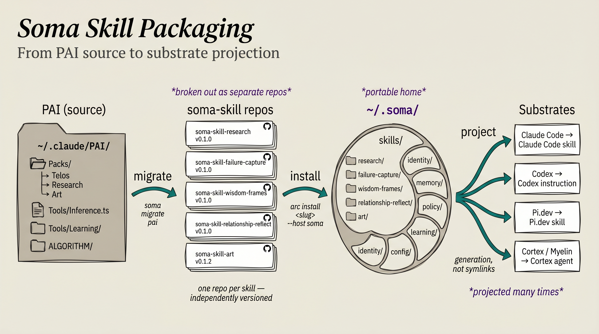

# Skill Packaging



Soma skills are portable, versioned, source-controlled artifacts that travel
with the principal across substrates. This document specifies the packaging
contract: how a skill is authored, how arc installs it into soma, and how soma
projects it into the substrates the principal is using.

It is the packaging companion to
[progressive-skill-loading.md](./progressive-skill-loading.md), which covers
the loading and routing side. Packaging answers: what is a skill, where does it
come from, how does it get into soma, how does it surface in a substrate.

Tracker: [soma#135](https://github.com/the-metafactory/soma/issues/135).

## Terminology

This document uses the canonical glossary in
[CONTEXT.md](../CONTEXT.md). In particular:

- **substrate** (not "harness", "host", "runtime", "platform") — Claude Code,
  Codex, Pi.dev, Cortex/Myelin.
- **project / projection** (not "translate", "render", "emit", "compile") —
  the act of mapping soma state into substrate-native shape, and its artifact.
- **install / reproject / upgrade / load / uninstall** — the five locked
  lifecycle verbs. `arc install` and `arc update` map to soma's **install** and
  **upgrade**; `soma project` is the explicit **reproject** verb.
- **migrate** — system-to-system orchestration (e.g. `soma migrate pai`).
  **import** — single artifact landing in soma.
- **skill** — soma's canonical, unqualified term. Substrate-native equivalents
  are always qualified: **Claude Code skill**, **Pi.dev skill**, **Codex
  instruction**, **Cortex agent**. "the skill's Claude Code projection" is the
  preferred phrasing for the projected output.
- **compartment** — a top-level section of the soma home (`Skills`, `Memory`,
  `Identity`, `Telos`, `Policy`, `Learning`). Skills live in the Skills
  compartment.
- **host** appears in this doc only in arc's own terminology — its `HostAdapter`
  abstraction and the `--host soma` install flag. That is arc's word, not a
  substrate synonym. Where "host" means "the principal's machine" the term is
  used colloquially in CLI output examples only.

## Problem

Soma already treats skills as substrate-portable folders under
`~/.soma/skills/<slug>/`. Two gaps prevent that surface from being a real
first-class packaging system:

1. **No authoring contract.** `soma-skill.json` exists today only as an artifact
   emitted by the PAI pack importer. There is no hand-authored manifest schema
   a skill author can target, no version field, no capability declarations, no
   substrate-support declarations.
2. **No external skill installation.** The only verbs that land skills in soma
   are `soma migrate pai` and `soma import pai-pack --pai-pack-dir <path>`.
   There is no `arc install <skill> --host soma`, no per-skill upstream tracking,
   no update flow that pulls a new version.

Meanwhile the metafactory ecosystem already runs a partial version of the right
model: one skill per GitHub repo, `arc-manifest.yaml` declaring identity +
capabilities + secrets, `arc install <name>` fetching and wiring. That model
symlinks into `~/.claude/skills/<name>/` and assumes a single substrate. Soma
needs the same authoring contract but with multi-substrate projection and
without filesystem symlinks.

This document specifies the unified contract.

## Goals

- One skill per repo, independently versioned, attributed, and capability-scoped.
- One canonical manifest schema (`soma-skill/v1`) replacing both
  `arc-manifest.yaml` (metafactory blueprint format) and the import-emitted
  `soma-skill.json` (PAI pack derivation).
- One canonical skill repo layout supporting substrate-neutral content plus
  optional per-substrate overlays.
- `arc install <skill> --host soma` lands the skill in `~/.soma/skills/<slug>/`,
  auto-detects available substrates on the host, and projects the skill into
  each one that the principal has enabled.
- Generation, not symlinking. Projection writes substrate-shaped files derived
  from the soma-home copy. Source of truth lives once, in soma.
- Existing metafactory `arc-skill-*` and PAI `pai-skill-*` repos migrate to the
  new shape without losing identity, version history, or capability declarations.
- The in-flight PAI Tools migration ([soma#128](https://github.com/the-metafactory/soma/issues/128))
  is re-imagined so behaviour-bearing tools land as `soma-skill-*` repos rather
  than as monolithic merges into soma core.

## Non-Goals

- A new registry. Arc already has `catalog.yaml`. Publishing/registry semantics
  are a separate concern (see Open Questions).
- A new package manager. Arc is the package manager; soma is the home that
  installed skills live in. This design adds one host (`--host soma`) and one
  manifest schema to arc; it does not duplicate arc.
- A new execution model for skills. Substrate adapters already exist
  (`src/adapters/claude-code.ts`, `codex/`, `pi-dev/`). This design specifies
  what they project; it does not redesign projection internals.
- Cross-skill code dependencies. Forbidden in v1; declared in the schema for
  later. Skills depend on soma core and on declared tools (e.g. `bun`), not on
  other skills.
- Replacing `soma migrate pai` or `soma import pai-pack`. Both remain. The PAI
  pack importer becomes one specific way skills enter soma; `arc install` is
  the routine way.

## Concepts

The terminology this design uses, deliberately precise:

- **soma home** — `~/.soma/`. The principal's portable data: identity, telos,
  memory, skills, policy, learning, state.
- **substrate** — an execution environment soma adapts to. Today: Claude Code,
  Codex, Pi.dev, Cortex/Myelin daemon.
- **substrate adapter** — code in `src/adapters/<substrate>` that reads a
  `ProjectionInput` (which now includes installed skills) and produces a
  `Projection` (files + instructions for that substrate).
- **projection** — the substrate-native surface generated from soma home.
  `~/.claude/rules/soma/*.md`, `~/.codex/AGENTS.md`, `~/.pi/agent/extensions/*`,
  plus the per-substrate skill projections this design adds.
- **skill** — a directory at `~/.soma/skills/<slug>/` containing a valid
  `soma-skill.json` + `SKILL.md`. The slug is the canonical name used by soma,
  arc, and projection paths.
- **skill repo** — the upstream source of a skill: a GitHub (or other VCS) repo
  named `soma-skill-<slug>` containing the canonical layout.
- **arc** — the package manager. Fetches, verifies, prompts for capabilities,
  resolves dependencies, calls into soma to land + project. New host: `soma`.
- **install** — the act of placing a skill in `~/.soma/skills/<slug>/` and
  projecting it into every enabled substrate. End-to-end, one `arc install`.
- **projection target** — a substrate the principal has marked enabled in
  `~/.soma/config/substrates.yaml`. Arc projects to every enabled target whose
  id is in the skill's `substrateSupport` array.

## Canonical Skill Repo Layout

```text
soma-skill-<slug>/                       ← own GitHub repo, own semver
├── soma-skill.json                      ← unified manifest (schema below)
├── SKILL.md                             ← substrate-neutral entrypoint
├── package.json + bun.lock              ← skill-local bun deps (if shipping tools)
├── tsconfig.json                        ← (if shipping TS tools)
├── README.md
├── CHANGELOG.md
├── tools/                               ← TS CLIs the skill ships
│   ├── <tool>.ts
│   └── lib/
├── workflows/                           ← portable workflow docs
├── references/                          ← deep docs, examples
├── tests/                               ← skill's own test suite
└── substrate/                           ← optional substrate-specific overlays
    ├── claude-code/
    │   ├── commands/<name>.md           ← slash commands
    │   ├── hooks/<name>.mjs             ← hook scripts
    │   └── agents/<name>.md             ← sub-agent specs
    ├── codex/
    │   ├── rules.fragment.md
    │   └── hooks/
    └── pi-dev/
        └── extension.ts.fragment
```

Mandatory: `soma-skill.json` + `SKILL.md`. Everything else is optional. A
pure-prompt skill (no tools) omits `package.json`, `tsconfig.json`, `tools/`,
`tests/`. A skill with no substrate-specific behaviour omits `substrate/`
entirely.

Notes:

- The skill folder is a self-contained bun project when it ships TS tools. Arc
  runs `bun install` inside `~/.soma/skills/<slug>/` after fetch, so the skill's
  deps live alongside the skill — no clash with soma core deps, no clash with
  other skills.
- `substrate/<id>/` mirrors the substrate's own concept names. Claude Code has
  `commands`, `hooks`, `agents`; Codex has `rules` + `hooks`; Pi.dev has
  `extensions`. The adapter knows where each piece lands in the substrate-shaped
  projection.

## Manifest Schema — `soma-skill/v1`

```jsonc
{
  "schema": "soma-skill/v1",
  "name": "code-review",                   // slug — stable, kebab-case, unique across soma
  "version": "0.2.0",                      // semver, mandatory
  "description": "Multi-lens PR review with automated findings.",
  "author": { "name": "mellanon", "github": "mellanon" },
  "license": "MIT",

  "entrypoint": "SKILL.md",

  "provides": {
    "triggers":     ["review PR", "code review", "security audit"],
    "antiTriggers": ["review document", "review research"],
    "tools": [
      {
        "name": "review",
        "command": "bun tools/review.ts",
        "description": "Run a single review lens against a PR.",
        "substrateSupport": ["claude-code", "codex", "pi-dev"]
      }
    ],
    "slashCommands": [
      { "name": "review-pr", "substrate": "claude-code" }
    ],
    "subagents": [
      { "name": "code-reviewer", "substrate": "claude-code" }
    ],
    "hooks": []
  },

  "depends_on": {
    "tools":  [{ "name": "bun", "version": ">=1.0.0" }],
    "skills": []                           // forbidden in v1; declared for future
  },

  "capabilities": {
    "bash":       { "allowed": true, "restricted_to": ["gh pr *", "gh api *"] },
    "filesystem": { "read":  [], "write": ["~/.soma/memory/work/**"] },
    "network":    [],
    "secrets":    [{ "name": "OPENAI_API_KEY", "reason": "model calls", "optional": false }]
  },

  "substrateSupport": ["claude-code", "codex", "pi-dev"],
  "estimatedTokens": 4200,
  "defaultLoad": "manifest",               // never | manifest | body

  "references": [
    {
      "path": "workflows/FullReview.md",
      "triggers": ["full review"],
      "estimatedTokens": 1500
    }
  ],

  "tags":   ["review", "github"],
  "phases": []                              // optional: Algorithm phase scoping
}
```

This is a strict superset of metafactory `arc/v1` plus the routing fields
specified in `progressive-skill-loading.md`. Migration of an
`arc-manifest.yaml`: rename file to `soma-skill.json`, convert YAML→JSON,
change `schema: arc/v1` → `schema: soma-skill/v1`, add the new
substrate/loading fields (most can be defaulted).

### Validation rules

- `name` must be unique across `~/.soma/skills/` after install. Arc rejects a
  name collision at install time.
- `version` must be semver. Arc tracks installed version per skill.
- `capabilities.bash.restricted_to[]` is mandatory if `capabilities.bash.allowed
  == true`. Soma refuses to project a skill that requests unrestricted bash.
- `substrateSupport[]` must be non-empty.
- `depends_on.skills[]` must be empty in v1. Arc refuses to install if non-empty.
- `provides.tools[*].command` must be a `bun tools/...` path (other runtimes
  TBD — see Open Questions).

### Slug ↔ repo name relationship

```text
repo name:        soma-skill-code-review
soma slug:        code-review                  (strip prefix)
soma home path:   ~/.soma/skills/code-review/
manifest name:    "name": "code-review"
arc catalog key:  code-review
```

The repo name is a human convention for clustering. The slug is the canonical
identifier inside soma and arc. Forks of a skill keep the same slug (so
projection paths don't change); arc's catalog records which upstream URL the
slug is sourced from.

## Install Flow

End-to-end, one verb the principal types:

```bash
arc install code-review --host soma
```

What happens, in order:

```
1. RESOLVE   — arc resolves "code-review" via catalog → repo URL + version
2. FETCH     — arc clones (or downloads release tarball) into staging
3. VALIDATE  — arc parses soma-skill.json against the v1 schema; refuse on invalid
4. RISK      — arc shows capability + secret summary, prompts principal to approve
                  (skipped on update if capabilities are unchanged)
5. LAND      — arc copies the validated tree to ~/.soma/skills/<slug>/
                  (full copy, not symlink — works on Linux, macOS, Windows,
                  through iCloud/Dropbox, inside Docker volumes)
6. DEPS      — arc runs `bun install` inside ~/.soma/skills/<slug>/ if
                  package.json exists
7. RECORD    — arc records the install in its own DB:
                  { slug, version, upstream_url, upstream_ref, installed_at,
                    capabilities_approved_at }
8. DETECT    — arc reads ~/.soma/config/substrates.yaml (creating it via
                  first-run prompt if absent — see "Auto-Detection" below)
9. PROJECT   — for each enabled substrate whose id is in skill.substrateSupport[]:
                  call soma's adapter to (re-)project that substrate, which now
                  includes this skill
10. VERIFY   — arc reports per-substrate projection result; refuses to consider
                  the install complete if any required substrate failed
```

Step 9 calls into soma's existing adapter code (`projectClaudeCodeHome`,
`projectCodexHome`, `projectPiDevHome`). The adapters gain a new input —
`installedSkills: SomaSkillManifest[]` — alongside the existing
`ProjectionInput`. They iterate skills, write per-skill projection files, and
return a unified projection.

### Update

Arc's `update` verb maps to soma's [[upgrade]] lifecycle event (CONTEXT.md
§"Lifecycle verbs"): a new version of an existing artifact lands, then
reprojection follows.

```bash
arc update code-review
```

Same flow as install with these differences:

- RESOLVE pulls the latest tag (or `HEAD` on the configured branch).
- RISK only prompts if the new manifest's capability set differs from the
  recorded approval. Capability diff is shown explicitly:
  ```
  Capability change since v0.2.0:
    + bash: "gh issue *" (new pattern)
    + secret: GITHUB_FINE_GRAINED_PAT (new, required)
  Continue? [y/N]
  ```
- LAND overwrites `~/.soma/skills/<slug>/`. Hand-edits are lost (use
  `--preserve-local` to error instead).
- PROJECT re-projects every enabled substrate.

### Uninstall

```bash
arc uninstall code-review
```

- Removes `~/.soma/skills/<slug>/`.
- Re-projects every enabled substrate (the absence of the skill removes its
  per-substrate files).
- Drops the install record from arc's DB.

### Batch

```bash
arc install code-review art doc claim-review --host soma
```

LAND each skill, then PROJECT each substrate exactly once at the end. Saves N
projection passes when installing many skills.

### Escape hatches

```bash
arc install foo --host soma --no-project       # fetch + land, defer projection
soma project claude-code                       # reproject one substrate
soma project --all                             # reproject every enabled substrate
soma install claude-code --apply               # legacy: standalone substrate setup
```

`soma install <substrate> --apply` remains for the bootstrap case (new machine,
no arc yet) and for explicit recovery (`--force` rewrites the projection from
scratch). For routine use the principal never types it.

## Auto-Detection

On first install, arc detects substrates available on the host and asks the
principal which should be projection targets. The answer persists, so
subsequent installs run silently.

### Detection rules

```ts
interface SubstrateDetection {
  id: SubstrateId;
  detected: boolean;
  signals: string[];   // why arc thinks the substrate is present
}

const rules: DetectionRule[] = [
  { id: "claude-code", check: () => exists("~/.claude") || onPath("claude") },
  { id: "codex",       check: () => exists("~/.codex")  || onPath("codex")  },
  { id: "pi-dev",      check: () => exists("~/.pi")     || onPath("pi")     },
  { id: "cortex",      check: () => onPath("cortex") },
];
```

Detection is opportunistic: signals are listed, but the principal confirms.
Presence of `~/.claude/` does not imply intent to project soma into it.

### First-run prompt

```text
$ arc install soma-skill-art --host soma

Detecting substrates on this host…
  ✓ ~/.claude/         (Claude Code)
  ✓ ~/.codex/          (Codex)
  ⊘ ~/.pi/             (not found)
  ✓ cortex on PATH     (Cortex/Myelin daemon)

Enable as soma projection targets?
  [Y/n] claude-code   y
  [Y/n] codex         y
  [Y/n] cortex        n   ← principal opts out

Wrote ~/.soma/config/substrates.yaml
```

### Config

```yaml
# ~/.soma/config/substrates.yaml
version: 1
substrates:
  claude-code:
    enabled: true
    scope: home              # home | workspace
    home_path: ~/.claude
  codex:
    enabled: true
    scope: home
    home_path: ~/.codex
  pi-dev:
    enabled: false           # detected later, opted out
    home_path: ~/.pi
  cortex:
    enabled: false           # detected, principal said no
defaults:
  on_new_substrate: prompt   # prompt | auto-enable | auto-disable
  capability_approval: prompt
```

`on_new_substrate: prompt` is the default: next time arc sees a new substrate
appear, it asks. Power users set `auto-enable` for silent operation.

### Workspace overlays

A repo can override home-mode config:

```yaml
# <repo>/.soma/config/substrates.yaml
substrates:
  codex:
    enabled: false           # this repo: claude only
```

Workspace overlay → home-mode config merge. Matches the runtime-modes pattern
(home overlays with workspace) defined in [CONTEXT.md](../CONTEXT.md) and
already used by `soma install claude-code --workspace`.

### Management verbs

```bash
soma substrates list                    # show config + current detection
soma substrates enable pi-dev           # opt in + re-project all installed skills
soma substrates disable codex           # opt out + unproject all installed skills
soma substrates detect                  # re-scan + propose updates
```

These live in soma (not arc) — soma owns substrate adapter semantics. Arc reads
the resulting config.

## Projection Model

Generated, not symlinked. Three reasons (in order of weight):

1. **Multi-substrate.** One source layout cannot symlink into three substrate
   shapes. Claude wants `.claude/skills/<name>/SKILL.md` and
   `.claude/commands/<name>.md`; Codex wants `.codex/skills/<name>/SKILL.md` and
   `.codex/rules/<name>.rules` fragments; Pi.dev wants a TypeScript extension.
   Generation lets one upstream feed all three.
2. **Idempotency + verifiability.** `arc install --dry-run` shows the exact byte
   diff. Re-installing the same version writes the same bytes. Symlinks can't
   give that property — the substrate sees whatever the upstream contains at
   read time, including in-flight edits.
3. **OS / cloud-sync independence.** Symlinks behave inconsistently across
   iCloud, Dropbox, Windows, Docker volumes, devcontainers. The principal's
   work travels via soma; the projection must travel with it.

### What gets projected per substrate

For each substrate `S` and each installed skill with `S ∈ substrateSupport`:

| Substrate | What lands in the projection |
| --- | --- |
| Claude Code | The skill's Claude Code projection: `~/.claude/skills/<slug>/SKILL.md` (rewritten with claude-native frontmatter, description compacted to ≤1024 chars), `~/.claude/skills/<slug>/workflows/*`, `~/.claude/skills/<slug>/references/*`, `~/.claude/commands/<name>.md` from `substrate/claude-code/commands/`, `~/.claude/hooks/<skill>-<event>.mjs` from `substrate/claude-code/hooks/`, Claude Code sub-agent specs from `substrate/claude-code/agents/`, capability allowlist merged into `~/.claude/settings.local.json`. The substrate primitive surfaced is a **Claude Code skill**. |
| Codex | The skill's Codex projection: `~/.codex/skills/<slug>/SKILL.md`, `~/.codex/rules/<slug>.rules` (substrate-neutral content + fragment from `substrate/codex/`), `~/.codex/hooks/` entries, capability declarations into `~/.codex/config.toml`. Codex has no native skill primitive; the surfaced shape is a **Codex instruction**. |
| Pi.dev | The skill's Pi.dev projection: `~/.pi/agent/skills/<slug>/SKILL.md`, optional `~/.pi/agent/extensions/<slug>.ts` from `substrate/pi-dev/extension.ts.fragment` wrapped in a generated substrate-side stub. The substrate primitive surfaced is a **Pi.dev skill**. |
| Cortex | The skill's Cortex projection: manifest registered with the Cortex daemon's skill registry via Myelin envelope; bodies remain readable from `~/.soma/skills/<slug>/` on demand. The substrate-bound process that consumes the projection is a **Cortex agent** running in daemon mode. |

The projection adds a registry-index file per substrate (e.g.
`~/.claude/rules/soma/SKILLS.md`) listing every projected skill with name,
description, triggers, capabilities, and source path. This is what the routing
layer reads (see `progressive-skill-loading.md` §"Skill Registry").

### Tools surface in each substrate

A skill's declared tools (`provides.tools[]`) are exposed to the substrate via
substrate-native means:

- **Claude Code** — tools are runnable from Bash via `bun ~/.soma/skills/<slug>/tools/<tool>.ts`; the projection writes a shell wrapper at `~/.claude/bin/<slug>-<tool>` (or similar) for ergonomic invocation. Capability allowlist already covers the bun command pattern.
- **Codex** — same wrapper pattern under `~/.codex/bin/` (or whatever Codex respects).
- **Pi.dev** — the projection wraps the tool as a Pi extension tool: a thin TS shim under `~/.pi/agent/extensions/` that registers a tool callable from the model loop, executing `bun ~/.soma/skills/<slug>/tools/<tool>.ts` under the hood.
- **Cortex** — the daemon spawns substrate sessions with the soma home mounted; tools are reachable in-process from any spawned session.

The tool source code lives once, in the skill folder. Substrate wrappers are
generated thin shims, not duplicated implementations.

### Uninstall cleanliness

Soma tracks projected paths per skill per substrate. `arc uninstall <slug>`
removes exactly the files soma wrote, never touching files outside the
projection envelope (`~/.claude/rules/soma/`, `~/.claude/skills/<slug>/`,
`~/.claude/commands/<slug>-*.md`, etc.). The principal's own `~/.claude/`
content is untouched.

## Naming Convention

| Artifact | Repo name | Soma slug | Examples |
| --- | --- | --- | --- |
| Soma skill | `soma-skill-<name>` | `<name>` | `soma-skill-art` → `art`, `soma-skill-code-review` → `code-review` |
| Soma core | `soma` | — | `soma` (already exists) |
| Soma adapter (rare) | `soma-adapter-<substrate>` | — | `soma-adapter-cortex` (hypothetical) |
| Skill bundle | `soma-pack-<name>` | many slugs | `soma-pack-pai-migration` (multi-skill collection) |
| Standalone tool | `soma-tool-<name>` | — | `soma-tool-registry-mirror` (hypothetical) |

**Cluster invariants:**

- `gh repo list the-metafactory --search soma-skill` returns the full catalog.
- `ls ~/Developer/ | grep '^soma-skill-'` matches every local checkout.
- `ls ~/.soma/skills/` lists every installed slug (no prefix — slugs are bare).

## Migration

### Existing metafactory skills (`arc-skill-*` repos)

Five repos today: `arc-skill-art`, `arc-skill-code-review`, `arc-skill-harvester`, `arc-skill-slides`, plus the manifest-fix variant. Per-repo migration is mechanical:

1. `gh repo rename soma-skill-<slug>` from the repo root (GitHub auto-redirects old URLs).
2. Rename `arc-manifest.yaml` → `soma-skill.json`. Convert YAML → JSON.
3. Change `schema: arc/v1` → `schema: soma-skill/v1`.
4. Add the new fields: `substrateSupport`, `antiTriggers`, `estimatedTokens`, `defaultLoad`, `references[]`. Most can be defaulted (`substrateSupport: ["claude-code", "codex", "pi-dev"]`, `defaultLoad: "manifest"`).
5. Move `skill/` content to repo root. Drop the `skill/` directory.
6. Rename `src/` (or `prompt/`) to `tools/`. Update `provides.tools[*].command` paths.
7. Move Claude-specific bits (slash commands, Claude Code sub-agent specs, hooks) under `substrate/claude-code/`.
8. Update `package.json` scripts and CI to reflect the new paths.
9. Cut a new release (typically `v1.0.0` to mark the soma-skill-shape transition).
10. Update `arc/catalog.yaml` slugs.

### Existing PAI skills (`pai-skill-*` repos)

Same procedure. Today there are ~15 such repos (`pai-skill-doc`, `pai-skill-coupa`, `pai-skill-confluence`, `pai-skill-context`, `pai-skill-claim-review`, `pai-skill-diagrams`, `pai-skill-dispatch`, `pai-skill-docx`, `pai-skill-gundog`, `pai-skill-jira`, `pai-skill-jira-analysis`, etc.). The `pai-manifest.yaml` schema is a near-twin of `arc-manifest.yaml`; the same rename + repath + JSON conversion applies.

### Bare-named skill-like repos

`harvester`, `distiller`, `release-manager`, `metafactory-skill`, etc. Decide per-repo whether each is a skill (rename to `soma-skill-<name>`), a multi-skill bundle (rename to `soma-pack-<name>`), or an independent tool / Cortex agent (no rename, no migration).

## PAI Tools Migration Re-imagined

The PAI Tools migration ([soma#128](https://github.com/the-metafactory/soma/issues/128)) currently scopes 13 tools across five phases ([soma#129](https://github.com/the-metafactory/soma/issues/129)–[soma#134](https://github.com/the-metafactory/soma/issues/134)). The original plan lands all 13 as soma core modules. With the packaging contract in place, that plan splits into two tracks:

### Track A: stays in soma core (primitives)

These are not skills. They are foundational primitives every skill depends on. They merge into `~/Developer/soma/src/`, expose typed APIs, and ship with soma's own release cycle.

| Original issue | Tool | Why it's core, not a skill |
| --- | --- | --- |
| [soma#129](https://github.com/the-metafactory/soma/issues/129) — Phase 1 | `Inference.ts` (substrate-agnostic model dispatch, 3 run levels, advisor mode) | Primitive: every skill that calls a model uses it. Skills depend on inference; inference is not itself a skill. Same shape as `path-utils.ts` in soma today. |
| [soma#134](https://github.com/the-metafactory/soma/issues/134) — cross-cutting | Path resolver (substrate-agnostic path resolution) | Primitive: every adapter and skill needs portable path resolution. Belongs in soma core (extends existing `src/path-utils.ts` / `src/soma-home.ts`). |
| [soma#133](https://github.com/the-metafactory/soma/issues/133) — Phase 5 (DEFERRED) | `algorithm.ts` (1,800 LOC) + `FeatureRegistry.ts` | The Algorithm Harness is already partially in soma core (`src/algorithm.ts` 10.9 KB). The extraction is core extension, not a skill. Stays deferred pending design clarity (see soma#133). |

### Track B: becomes `soma-skill-*` repos (behaviour-bearing)

These are domain-specific behaviours that consume the core primitives. They migrate as individual `soma-skill-*` repos with their own version, capability declarations, and tests. Arc installs them; soma projects them.

| Original issue | Tools | Proposed skill repo(s) | Notes |
| --- | --- | --- | --- |
| [soma#130](https://github.com/the-metafactory/soma/issues/130) — Phase 2 (Learning Pipeline, 6 tools) | pattern synthesis | `soma-skill-learning-synthesis` | Synthesises patterns from session events using `Inference.ts`. |
|  | opinion tracking | `soma-skill-opinion-tracking` | Tracks how stated principles/opinions change over time. |
|  | failure capture | `soma-skill-failure-capture` | Post-mortem capture, lessons routing into memory. |
|  | session harvesting | `soma-skill-session-harvest` | Extract durable knowledge from session transcripts. |
|  | metrics | `soma-skill-metrics` | Operational metrics on assistant performance + learning signals. |
|  | progress | `soma-skill-progress` | Progress reporting / status synthesis across active ISAs. |
| [soma#131](https://github.com/the-metafactory/soma/issues/131) — Phase 3 (Wisdom Frames, 3 tools) | domain classifier, frame updater, cross-frame synthesizer | `soma-skill-wisdom-frames` | Single skill repo — the three tools genuinely co-evolve (shared frame schema). The architecture decision soma#131 calls out (knowledge taxonomy ownership) becomes a DD inside soma core: "where do frame schemas live, who can extend them." |
| [soma#132](https://github.com/the-metafactory/soma/issues/132) — Phase 4 | `RelationshipReflect.ts` (opinion updates, milestone detection, notification) | `soma-skill-relationship-reflect` | Single skill. Notification dispatch goes through soma core's notification primitive (or a separate `soma-skill-notify` if more skills need notification). |

**Net outcome:** 6–8 new `soma-skill-*` repos instead of 13 monolithic merges into soma core. Each ships its own semver, capability sandbox, and tests. Each is installable independently — a principal who doesn't care about wisdom frames just doesn't `arc install soma-skill-wisdom-frames`.

### Sequencing

1. **Land the packaging contract first.** This design doc → implementation in soma core (manifest parser, install/uninstall verbs, projection updates) → arc-side host adapter.
2. **Migrate one existing arc-skill** as the proof-of-shape. Recommend `arc-skill-doc` (smallest, has tools + workflows + no substrate-specific bits — clean end-to-end test).
3. **Re-scope PAI Tools tracker issues.** Update soma#128 + #129–#134 to reflect the split: core primitives vs `soma-skill-*` repos.
4. **Build out Track A primitives in soma core** (Inference engine, path resolver, Algorithm harness if approved).
5. **Stand up one Track B skill repo at a time** (recommend `soma-skill-failure-capture` first — narrow scope, well-defined trigger, exercises capability sandbox).
6. **Migrate remaining `arc-skill-*` / `pai-skill-*` repos** in parallel with Track B work.

## Open Questions

1. **Tool runtimes beyond bun.** `provides.tools[*].command` is currently constrained to `bun tools/...`. Permit Python (`python tools/...`) and shell (`bash tools/...`)? Almost certainly yes, but the capability sandbox needs to handle them.
2. **Cross-skill dependencies.** Forbidden in v1. When do we lift the restriction? What does shared-skill code look like — a transitive `bun install`-style flat structure, or do shared utilities go in a separate `soma-tool-*` repo?
3. **Registry semantics.** Today arc resolves slugs via `catalog.yaml` (static, in-repo). For external skill publishing, do we need a remote registry index, a permissionless one (anyone can publish), or a curated one (metafactory-stewarded)? Out of scope here; design separately.
4. **Capability change semantics on update.** Approval prompt covers additive changes. What about restrictive changes (a v0.3.0 drops a previously-approved capability)? Silent? Notify? Recommended: notify with no prompt.
5. **Workspace-pinned skill versions.** A workspace might want `soma-skill-foo@0.2.0` while the host home has `@0.3.0`. Supported? In v1 the home version wins; later we may add `<workspace>/.soma/skills.lock` for per-workspace pinning.
6. **Hand-edit policy.** If a principal hand-edits `~/.soma/skills/<slug>/`, what does `arc update` do? Default proposal: overwrite with warning, `--preserve-local` errors out. The "correct" home for principal customisations is a separate overlay under `~/.soma/skills/<slug>/local/` that arc never touches.
7. **Reserved slug list.** PAI migration already refuses to overwrite `isa` (bundled). What is the full reserved set for v1? Recommend: `isa`, `the-algorithm`, plus any slug that ships with soma core.
8. **Multi-skill repos (the `soma-pack-*` case).** Should arc support `arc install soma-pack-foo --host soma` installing all nested skills atomically? Or must each be installed by slug? Recommend: pack-level install with per-skill capability prompts.

## Verification Criteria

The packaging contract is considered shipped when each of these is true:

1. `soma-skill.json` schema exists, is documented, and ships with a JSON Schema for editor validation.
2. Arc accepts `--host soma`, lands a valid skill at `~/.soma/skills/<slug>/`, runs `bun install` inside it, and records the install in its DB.
3. Arc auto-detects substrates on first install and writes `~/.soma/config/substrates.yaml`.
4. `arc install` projects to every enabled substrate whose id is in the skill's `substrateSupport[]`, end-to-end, in one command.
5. `arc update <slug>` re-fetches, re-validates, and re-projects. Capability diffs trigger a re-approval prompt.
6. `arc uninstall <slug>` removes the skill from soma home and from every projection, untouching any file outside the projection envelope.
7. `soma install <substrate> --apply` still works (legacy / bootstrap / recovery).
8. `soma substrates list|enable|disable|detect` works against the config file.
9. The migration of one real existing skill (`arc-skill-doc` recommended) succeeds end-to-end, installable from `arc install doc --host soma`, surface-equivalent in Claude Code, Codex, and Pi.dev.
10. The PAI Tools tracker issues (soma#128 + #129–#134) are re-scoped per Track A / Track B above, with the Track B skill repos either created or scheduled.
11. No symlink calls exist in arc's `install` or soma's adapter code for skill installation. (`grep -r symlink src/` returns nothing in the install/projection paths.)
12. Re-running `arc install <slug>` with no upstream changes is a no-op: same byte content in `~/.soma/skills/<slug>/` and in every projection.

## Decisions To Record

When this design is approved, add to `design/design-decisions.md`:

- **DD-N**: Skills are first-class portable artifacts authored in `soma-skill-<name>` repos, installed via arc, projected by soma.
- **DD-N+1**: `soma-skill/v1` is the canonical manifest schema; `arc/v1` is deprecated (one-release acceptance window with warning).
- **DD-N+2**: Projection is generation, never symlinking, for multi-substrate portability and OS/cloud-sync neutrality.
- **DD-N+3**: Arc auto-detects substrates on first install; principal confirms per-substrate; config persists in `~/.soma/config/substrates.yaml`.
- **DD-N+4**: PAI Tools migration splits Track A (core primitives) from Track B (`soma-skill-*` repos). Inference, path resolver, Algorithm harness are Track A. Learning pipeline, wisdom frames, relationship reflection are Track B.
